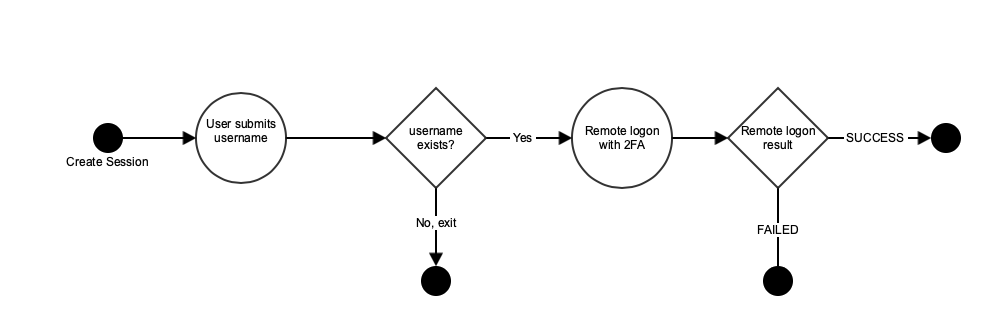
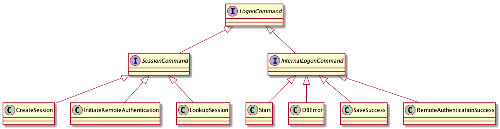

# Akka Typed Actors

## Should I Start Using Them? 

Willem Vermeer

Tradecloud - The Netherlands 

February 2019

---
### Example of an untyped actor
---?image=src/main/resources/nicholson.jpeg&size=contain
--- 
### Example of a typed actor
---?image=src/main/resources/Chuck_Norris.jpg&size=contain
---
### Which problem are we solving?

```scala
val actor: ActorRef = ???

actor ! AnyMessage
actor ! "message"
actor ! 42

actor.ask(command).mapTo[Result]
```
@[1-5](No way to know if actor can handle this type of message)
@[7](No way to know whether this cast is safe)

---

### Typed messages - tell

```scala
case class Greet(msg: String)

val actor: ActorRef[Greet] = ???

actor ! Greet("Hello")

actor ! "message" // won't compile
```
---

### Typed messages - ask

```scala
case class Greet(msg: String, replyTo: ActorRef[Response])
case class Response(resp: String)

val actor: ActorRef[Greet] = ???

val result: Future[Response] = 
  actor ? ref => Greet("Hello", ref)
```

---

### What will we gain?

type safety!

---
### What will be gone/different?

@ul

- inheritance from Actor
- sender()
- forward()
- preStart()/preRestart()/postStop()/postRestart()
- context.become()
- flexibility?

@ulend

---
### Goodbye Actor, hello Behavior
---
### Dependency

```scala
libraryDependencies += 
  "com.typesafe.akka" %% "akka-actor-typed" % "2.5.21"
```

This includes the untyped actor code!

Actually typed.ActorSystem is built on the untyped ActorSystem.

---

### Imports

```scala
import akka.actor.ActorSystem
import akka.actor.typed.ActorSystem
import akka.actor.ActorRef
import akka.actor.typed.ActorRef

```

Watch out which one you refer to!

---

+++?code=src/main/scala/Example1.scala&lang=scala&title=Our first typed actor system

@[1-2](Imports from akka.actor.typed)
@[6](Our single message type)
@[8-13](Behavior for messages of type Greet. Note we cannot send a reply here)
@[15-16](Definition of our ActorSystem, which is in itself an ActorRef)
@[18](Send a message to our single actor(system))
---
### Output from first typed actor system
```scala
$ sbt run
Received a greeting Hello
```
---

### Using the ask pattern
+++?code=src/main/scala/Example2.scala&lang=scala&title=How to use the ask pattern

@[4](Importing the ask pattern)
@[8](Importing future because an ask terminates in the future)
@[13-15](Define type Response and add it to Greet)
@[17-24](We now have a replyTo to send Response to)
@[29-32](Context setup)
@[34-35](Create a future which terminates when we receive an answer)
@[37-40](Do something with the result)

---
### Output from ask example
```
$ sbt run
Received a greeting Hello
Received answer: You say Hello I say Goodbye!
```
---
### Behavior creation, initialization and state
+++?code=src/main/scala/Example3.scala&lang=scala&title=Behavior setup and state

@[13-19](A new behavior to count the number of messages received)
@[24-25](Use Behaviors.setup to get access to context)
@[27-28](Use context to spawn one child with a unique name)
@[30-37](Send a notification to greetCounter)
@[47-56](Send three messages to root actor)

---
### Output from behavior setup and state example
```scala
$ sbt run
Received a greeting Hello Julia
Received msg nr 0 Hello Julia
Received a greeting Hello Emma
Received a greeting Hello Sophie
Received answer: You say Hello Julia I say Goodbye!
Received answer: You say Hello Emma I say Goodbye!
Received answer: You say Hello Sophie I say Goodbye!
Received msg nr 1 Hello Emma
Received msg nr 2 Hello Sophie
```

---

### Using a trait to handle multiple messages
+++?code=src/main/scala/Example4.scala&lang=scala&title=Using a trait to handle multiple messages
@[28-32](Define a trait so our actor can handle multiple messages)
@[13-26](Handle both messages, both returning an Int)
@[34-35](Create and initialize the typed ActorSystem)
@[41-46](Add and subtract)
@[43](Why do we need to explicitly give ref a type?)

---
```scala
  future.flatMap {
    _ => system ? (ref => Subtract(7, ref)) // compiler error
  }.onComplete {
    case Success(x) => println(s"End result = $x")
  }
```
@[2](Compiler complains "Type mismatch, expected: ActorRef[Int], actual: ActorRef[Nothing]"")
---

---
### Output from ask example
```
$ sbt run
Result = 5
Result = -2
End result = -2
```
---
### Working with futures
+++?code=src/main/scala/Example5.scala&lang=scala&title=Working with futures
@[60-64](Simplified repository with a Future method)
@[16-19](Message types: Loaded is only used by the actor itself)
@[26](Create a stashbuffer to temporarily store messages during future execution)
@[27-36](While we are waiting for future to complete, behave as loading)
@[38-43](When future finishes, reply with User)
@[44-47](In the meantime, stash any other incoming messages)
@[76-81](Run it)
@[84-89](But what happens in case of Failure?)
@[38-48](We can't send Status.Failure back to replyTo because it doesn't match type User)

---
### So this is no longer possible

```scala
replyTo ! akka.actor.Status.Failure(ex)
```
@[1](No longer possible because your Response type most likely isn't Status.Failure)

---
### But there is hope

https://github.com/akka/akka/issues/25781

Opened on Oct 11 this year

"A way to fail ask Future from response message"

---
### In the meantime
+++?code=src/main/scala/Example6.scala&lang=scala&title=Working with failing futures
@[42-48](We choose to wrap the possible results in an Either)

---
### Important when using ask

@ul
- make sure you actively reply to the originator!
- Behaviors.stopped or throwing an exception will go unnoticed to the originator
- in that case the ask will timeout and your onComplete will match on case Failure  
@ulend

---
### Case study: logon

Goal: build an identity provider to authenticate users for third parties

@ul

- user storage in a database 
- interaction with 2FA server

@ulend

---

### Logon state diagram


---

### Logon system architecture


---
### Life in a strictly typed world

How do we get a reference to the typed LogonManager actor so we can use it from the http layer?
+++?code=src/main/scala/Example3.scala&lang=scala&title=How to get a reference to a typed actor
@[40-41](All we know here is that our ActorSystem knows how to handle Greet's)
@[24-28](val greetCounter is local to rootBehavior!)
---
### Option 1: use the SpawnProtocol
+++?code=src/main/scala/Example7.scala&lang=scala
@[21-23](Define ActorSystem of type akka.actor.typed.SpawnProtocol)
@[34-36](Spawn a greeter actor by specifying behavior)
@[38](Use it)
@[21-23](Can only be used to spawn, not for lookup)
---
### Option 2: use the Receptionist
```scala
Behaviors.setup { ctx =>
  ctx.system.receptionist ! 
    Receptionist.Register(MyActorKey, ctx.self)
  }
  
system.receptionist ? 
  (ref => Receptionist.Find[MyType](MyActorKey)(ref))
  
// this gives you a Listing, containing the actors
// matching the requested MyType
```
---
### Option 3: cheat!
@ul
- typed and untyped actors can coexist
- you can convert typed.ActorSystem to untyped and vice versa
- typed actors can send messages to untyped actors and vice versa
- you can create typed actors from untyped system
- Http()(implicit val system: akka.actor.ActorSystem)  
@ulend
---
### Option 3 continued
Spawn your typed actors from an untyped system and get a direct reference for free!
```scala
import akka.actor.typed.scaladsl.adapter._
val system = akka.actor.ActorSystem()
val typedActor = system.spawn(
    TypedActor.behavior("some arg"), "TypedActorName")
// typedActor's type is inferred from TypedActor.behavior
```
---
### Putting it all together


+++?code=src/main/scala/com/example/logon/MainRoute.scala&lang=scala&title=Route definitions
@[34-45](Endpoint definitions)

+++?code=src/main/scala/com/example/logon/Boot.scala&lang=scala&title=Bootstrapping
@[13-14](Create an untyped ActorSystem)
@[19-26](Create and start an Http server)
+++?code=src/main/scala/com/example/logon/LogonCommand.scala&lang=scala&title=Type definitions
@[6](The main trait)
@[8-10](A specialized version of LogonCommand for incoming messages)
@[13-16](Example implementation of SessionCommand)
@[30](Response definition - the Response always contains a Session...)
@[32-40](..unless we return an Error)
+++?code=src/main/scala/com/example/logon/MainRoute.scala&lang=scala&title=Main route
@[28-32](Spawn a typed actor)
@[58-61](Ask typed actor to create a new Session)
@[62-69](Handle future completion)
+++?code=src/main/scala/com/example/logon/LogonManager.scala&lang=scala&title=LogonManager
@[15-17](Define a behavior and pass in two dependencies)
@[33-38](Main behaviour. Pass the command on to the LogonHandler (e.g. forward))
@[21-31](Defer the handling to a child actor)
+++?code=src/main/scala/com/example/logon/LogonHandler.scala&lang=scala&title=LogonHandler
@[16-28](Internal messages)
---
### Message types hierarchy
 
+++?code=src/main/scala/com/example/logon/LogonHandler.scala&lang=scala&title=LogonHandler
@[37-40](Define the Behavior of type LogonCommand)
@[146-155](Initialize the actor by loading a (possibly) existing session)
@[46-58](Handle the result of loading the session)
@[59-66](Error handler for database failure)
@[67-68](Main handler: active())
@[70-80](Create a Session if needed)
@[112-126](Saving behavior: wait for successful save or error)

---

### Conclusions

@ul

- type safety makes code more explicit
- typed actors bit more noisy
- typed and untyped play nicely together => smooth migration
- opportunity to refactor and rethink failure handling
@ulend

---
### Thank you!

@willemvermeer

github.com/willemvermeer/typed-actors

@size[14px](slides created with GitPitch)
@size[14px](Jack Nicholson picture: Martin Schoeller 2002)
@size[14px](Chuck Norris picture: togetherweserved.com)

