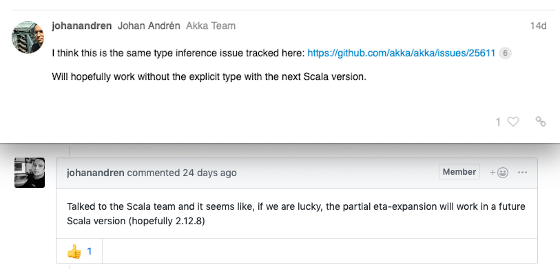
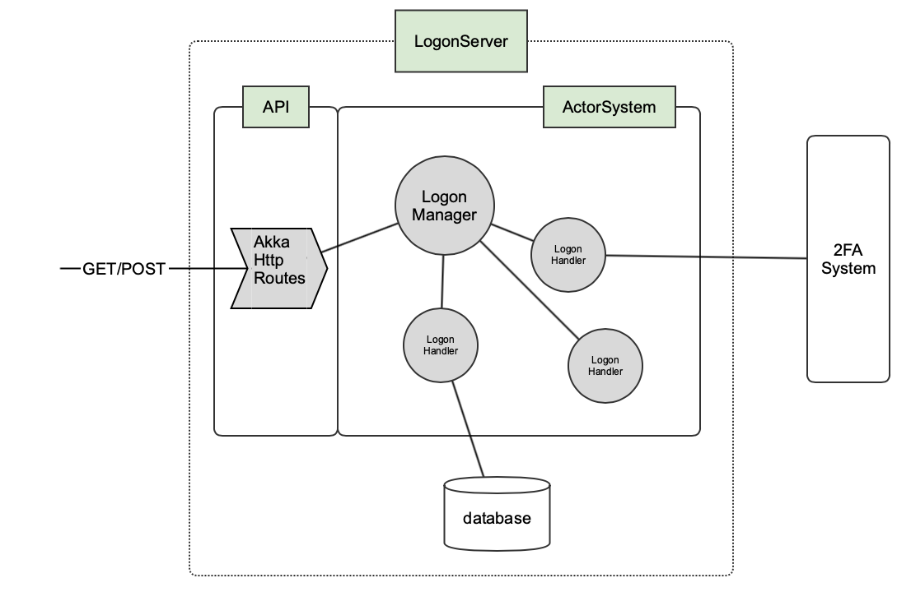

# Akka Typed Actors

## Should I Start Using Them? 

Willem Vermeer

Cleverbase November 2018

---

### Which problem are we solving?

```scala
actor ! AnyMessage
actor ! "message"
actor ! 42

actor.ask(command).mapTo[Result]
```
@[1-3](No way to know if actor can handle this type of message)
@[5](No way to know whether this cast is safe)

---

### Typed messages - tell

```scala
case class Greet(msg: String)

val actor: ActorRef[Greet] = ???

actor ! Greet("Hello")

actor ! "message" // won't compile
```
---

### Typed messages - ask

```scala
case class Greet(msg: String, replyTo: ActorRef[Response])
case class Response(resp: String)

val actor: ActorRef[Greet] = ???

val result: Future[Response] = 
  actor ? ref => Greet("Hello", ref)
```

---

### What will we gain?

type safety!

---
### What will be gone?

@ul

- inheritance from Actor
- sender()
- forward()
- preStart()/preRestart()/postStop()/postRestart()
- context.become()
- flexibility?

@ulend

---
### Goodbye Actor, hello Behavior
---
### Dependency

```scala
libraryDependencies += 
  "com.typesafe.akka" %% "akka-actor-typed" % "2.5.17"
```

This includes the untyped actor code!

Actually typed.ActorSystem is built on the untyped ActorSystem.

---

### Imports

```scala
import akka.actor.ActorSystem
import akka.actor.typed.ActorSystem
import akka.actor.ActorRef
import akka.actor.typed.ActorRef

```

Watch out which one you refer to!

---

+++?code=src/main/scala/Example1.scala&lang=scala&title=Our first typed actor system

@[1-2](Imports from akka.actor.typed)
@[6](Our single message type)
@[8-13](Behavior for messages of type Greet. Note we cannot send a reply here)
@[15-16](Definition of our ActorSystem, which is in itself an ActorRef)
@[18](Send a message to our single actor(system))
---
### Output from first typed actor system
```scala
$ sbt run
Received a greeting Hello
```
---

### Using the ask pattern
+++?code=src/main/scala/Example2.scala&lang=scala&title=How to use the ask pattern

@[4](Importing the ask pattern)
@[8](Importing future because an ask terminates in the future)
@[13-15](Define type Response and add it to Greet)
@[17](Signature of main actor stays the same!)
@[17-24](We now have a replyTo to send Response to)
@[29-32](Context setup)
@[34-35](Create a future which terminates when we receive an answer)
@[35](Ref is of type ActorRef[Response])
@[37-39](Do something with the result)

---
### Output from ask example
```
$ sbt run
Received a greeting Hello
Received answer: You say Hello I say Goodbye!
```
---
### Behavior creation, initialization and state
+++?code=src/main/scala/Example3.scala&lang=scala&title=Behavior setup and state

@[13-19](A new behavior to count the number of messages received)
@[17](Return behavior with new state)
@[24-25](Use Behaviors.setup to get access to context)
@[27-28](Use context to spawn one child with a unique name)
@[33](Send a notification to greetCounter)
@[47-56](Send three messages to root actor)

---
### Output from behavior setup and state example
```scala
$ sbt run
Received a greeting Hello Julia
Received msg nr 0 Hello Julia
Received a greeting Hello Emma
Received a greeting Hello Sophie
Received answer: You say Hello Julia I say Goodbye!
Received answer: You say Hello Emma I say Goodbye!
Received answer: You say Hello Sophie I say Goodbye!
Received msg nr 1 Hello Emma
Received msg nr 2 Hello Sophie
```

---
### Overview various Behaviors

@ul

- Behaviors.receiveMessage - when you just want to handle messages
- Behaviors.receiveSignal - respond to lifecycle Signals such as PreRestart, PostStop or Terminated
- Behaviors.receive - combination of regular messages and lifecycle Signals
- Behaviors.setup - factory method to create a Behavior with initialization

@ulend

---

### Using a trait to handle multiple messages
+++?code=src/main/scala/Example4.scala&lang=scala&title=Using a trait to handle multiple messages

@[28-32](Define a trait so our actor can handle multiple messages)
@[13-26](Handle both messages, both returning an Int)
@[41-46](Add and subtract)
@[43](Why do we need to explicitly give ref a type?)

---
```scala
  future.flatMap {
    _ => system ? (ref => Subtract(7, ref)) // compiler error
  }.onComplete {
    case Success(x) => println(s"End result = $x")
  }
```
@[2](Compiler complains "Type mismatch, expected: ActorRef[Int], actual: ActorRef[Nothing]"")
---

---
### Output from ask example
```
$ sbt run
Result = 5
Result = -2
End result = -2
```
---
### Working with futures
+++?code=src/main/scala/Example5.scala&lang=scala&title=Working with futures
@[60-64](Simplified repository with a Future method)
@[14](Moved the behavior to a separate object UserActor)
@[27-36](While we are waiting for future to complete, behave as loading)
@[17-18](New internal message type)
@[38-43](When future finishes, reply with User)
@[44-47](In the meantime, stash any other incoming messages)
@[76-81](Run it)
@[84-89](But what happens in case of Failure?)
@[38-48](We can't send Status.Failure back to replyTo because it doesn't match type User)

---
### So this is no longer possible

```scala
replyTo ! akka.actor.Status.Failure(ex)
```
@[1](No longer possible because your Response type most likely isn't Status.Failure)

---
### But there is hope

https://github.com/akka/akka/issues/25781

Opened on Oct 11 this year

"A way to fail ask Future from response message"

---
### In the meantime
+++?code=src/main/scala/Example6.scala&lang=scala&title=Working with failing futures
@[44-49](We choose to wrap the possible results in an Either)
@[41](Mind you - this changes the type of the Response)

---
### Important when using ask

@ul
- make sure you actively reply to the originator!
- Behaviors.stopped or throwing an exception will go unnoticed to the originator
- in that case the ask will timeout and your onComplete will match on case Failure  
@ulend

---
### Case study: logon

Goal: build an identity provider to authenticate users for third parties

@ul

- user storage in a database 
- interaction with 2FA server

@ulend

---

### Logon state diagram


---

### Logon system architecture



---
### Life in a strictly typed world

How do we get a reference to the typed LogonManager actor so we can use it from the http layer?
---
+++?code=src/main/scala/Example3.scala&lang=scala&title=How to get a reference to a typed actor
@[40-41](All we know here is that our ActorSystem knows how to handle Greet's)
@[24-28](val greetCounter is local to rootBehavior!)
---
### Option 1: use the SpawnProtocol
+++?code=src/main/scala/Example7.scala&lang=scala&title=The SpawnProtocol
@[21-23](Define ActorSystem of type akka.actor.typed.SpawnProtocol)
@[34-36](Spawn a greeter actor by specifying behavior)
@[38](Use it)
@[21-23](Can only be used to spawn, not for lookup)
---
### Option 2: use the Receptionist
```scala
Behaviors.setup { ctx =>
  ctx.system.receptionist ! 
    Receptionist.Register(MyActorKey, ctx.self)
  }
  
system.receptionist ? 
  (ref => Receptionist.Find[MyType](MyActorKey)(ref))
  
// this gives you a Listing, containing the actors
// matching the requested MyType
```
---
### Option 3: cheat!
@ul
- typed and untyped actors can coexist
- you can convert typed.ActorSystem to untyped and vice versa
- typed actors can send messages to untyped actors and vice versa
- you can create typed actors from untyped system
- Http()(implicit val system: akka.actor.ActorSystem)  
@ulend
---
### Option 3 continued
Spawn your untyped actors from an untyped system and get a direct reference for free!
```scala
import akka.actor.typed.scaladsl.adapter._
val system = akka.actor.ActorSystem()
val typedActor = system.spawn(
    TypedActor.behavior("some arg"), "TypedActorName")
// typedActor's type is inferred from TypedActor.behavior
```
---
### Case study - waar zijn we tegenaan gelopen

make sure you really answer the ask initiatior! Behaviors.stopped or throw ex won't do it!

is een manager echt nodig
hoe gaan we om met meerdere messages met zelfde supertype - ClassWithRef


---
### Current status 2.5.18 Api may change - wat dan?
---
### Thank you!

Slides created with GitPitch